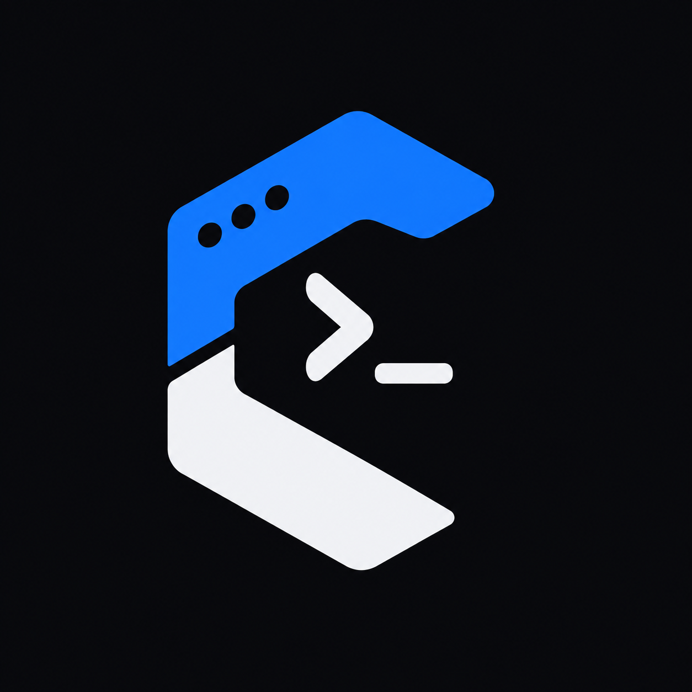

  

<h1 align="center">Cliva</h1>

  A modern, expressive, and modular Rust toolkit for building command-line applications.

  <strong>Cliva v0.1.0</strong> · <strong>Cliva I/O v0.1.5</strong>

---

## About

Cliva is a Rust library designed to make building command-line applications simple, structured, and maintainable.

It provides a focused foundation for CLI applications, with an API designed around clarity and composability. Cliva aims to handle the common building blocks of command-line software while leaving application-specific behavior in the hands of the developer.

The project is developed as part of **The Nexment Project**, with a long-term focus on building reliable and reusable Rust tooling.

## Cliva

**Cliva** is the primary library of the project.

It provides the interface for defining and building command-line applications, including command structure, arguments, options, environment integration, and other CLI functionality.

Cliva is intended to be the main entry point for developers building applications with the framework.

**Version:** `0.1.0`

## Cliva I/O

**Cliva I/O** is the terminal I/O component of the Cliva ecosystem.

It provides the terminal input and output functionality used by Cliva, keeping I/O concerns separate from the higher-level CLI interface.

This separation allows the I/O layer to remain focused and reusable while Cliva provides the developer-facing API.

**Version:** `0.1.5`

## Project Structure

The project is organized as a Rust workspace containing:

- **Cliva** — The main CLI library.
- **Cliva I/O** — Terminal input and output library.

Each crate maintains its own independent version, allowing the components to evolve independently while remaining part of the same ecosystem.

## Status

Cliva is currently in **v0.1 development**.

The `0.1.x` release series is intended for active development and API evolution. Interfaces may change as the project matures toward a stable release.

## The Nexment Project

Cliva is built under **The Nexment Project**, an initiative focused on developing practical, maintainable, and open-source software with Rust and other modern technologies.

## Website & Documentation

**Project Website:**  
https://app.nexment.in/projects/cliva

**Documentation:**  
https://docs.nexment.in/cliva

## License

Cliva is licensed under the **Apache License 2.0**.

See the [LICENSE](./LICENSE) file for the complete license text.

---

  Built with Rust · Built under **The Nexment Project**

